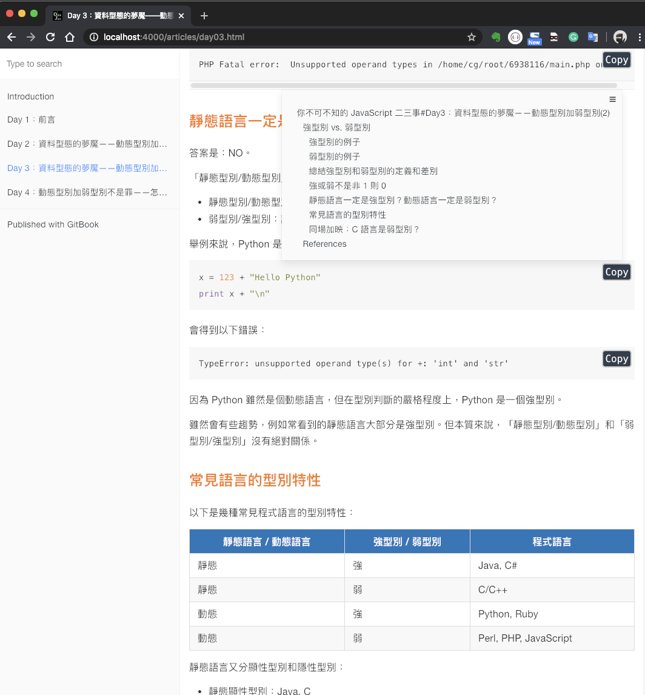
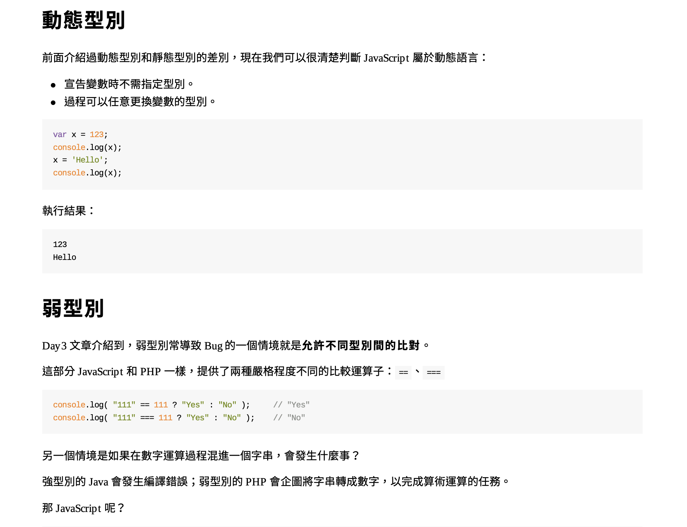

# gitbook

## Introduction

A customized image for gitbook based on node:12.16.1.


### Featrues

- Basic `gitbook` command line.
- Support customizing favicon.ico of static sites.
- Support making PDF (by full version)
- Support PDF 中文編碼 (using [Google Noto Sans CJK TC](https://www.google.com/get/noto/#sans-hant))


### Environment information

light version:
```bash
/gitbook # gitbook --version
CLI version: 2.3.2
/gitbook # node -v
v18.16.0
/gitbook # npx -v
9.5.1
/gitbook # npm -v
9.5.1
```

full version:
```bash
root@bc3df8ddf34b:/gitbook# gitbook --version
CLI version: 2.3.2
GitBook version: 3.2.3
# node -v
v12.16.1
# npx -v
6.13.4
# npm -v
6.13.4
root@bc3df8ddf34b:/gitbook#
```

### Full version vs. Light version

There are 2 versions for different purposes:

| Version | Image Size | Description                         |
|:-------:|:----------:|:------------------------------------|
| light   | 310MB      | Support Static Sites building.       |
| full    | 2.09GB     | Support Static Sites & PDF building. |


## Quick Start

```bash
$ cd book_sources_example   # folder of your book
$ docker run --rm -p 4000:4000 -v $(pwd):/gitbook onejar99/gitbook:light "gitbook init && gitbook install && gitbook build"
$ docker run --rm -p 4000:4000 -v $(pwd):/gitbook onejar99/gitbook:full "gitbook init && gitbook install && gitbook pdf"
```


## User Guide

> NOTE: `README.md` is required, even it's empty. (can be generated by `gitbook init`)


### 1. Build Static Sites

Build a static site:
```bash
$ cd book_sources_example   # the folder of your book
$ docker run --rm -p 4000:4000 -v $(pwd):/gitbook onejar99/gitbook:light "gitbook init"
$ docker run --rm -p 4000:4000 -v $(pwd):/gitbook onejar99/gitbook:light "gitbook install && gitbook build"
```

Output files will be in `$(pwd)/_book` folder.

Verify the site with a light web server:
```bash
$ docker run --rm  -p 4000:8080 -v $(pwd)/_book:/home/app/public onejar99/nodejs-live-server:node12.16.1
```
and then visit http://localhost:4000.


You can customize following files:
- `book.json`: customize gitbook plugins configuration by your requirements.
- `favicon.ico`: (optional) static site's favicon.


Result Demo:



### 2. Build PDF (by full version)

Build a PDF book:

```bash
$ cd book_sources_example   # the folder of your book
$ docker run --rm -p 4000:4000 -v $(pwd):/gitbook onejar99/gitbook:full "gitbook init"
# by default, pdf file named "book.pdf"
$ docker run --rm -p 4000:4000 -v $(pwd):/gitbook onejar99/gitbook:full "gitbook install && gitbook pdf"
# specify pdf file name as "mybook.pdf"
$ docker run --rm -p 4000:4000 -v $(pwd):/gitbook onejar99/gitbook:full "gitbook install && gitbook pdf ./ mybook.pdf"
```

You can customize following files:
- `cover.jpg`: (optional) cover of output PDF.


Result Demo:




### 3. Serving By Development Mode (`gitbook serve`)

```bash
$ cd book_sources_example   # the folder of your book
$ docker run --rm -ti -p 4000:4000 -v $(pwd):/gitbook onejar99/gitbook:light /bin/bash
root@09d781d735bd:/gitbook# gitbook install
root@09d781d735bd:/gitbook# gitbook serve
```
and then visit http://localhost:4000.


### 4. Serving Directly (Not Recommended)

```bash
$ cd book_sources_example   # the folder of your book
$ docker run --rm -p 4000:4000 -v $(pwd):/gitbook onejar99/gitbook:light "gitbook init"
$ docker run --rm -p 4000:4000 -v $(pwd):/gitbook onejar99/gitbook:light "gitbook install"
$ docker run --rm -p 4000:4000 -v $(pwd):/gitbook onejar99/gitbook:light "gitbook serve"
```
and then visit http://localhost:4000.

> NOTE: Because the container cannot receive the signal of Ctrl + C, you must terminate it by `docker stop`. That's why this usage is not recommended.

```bash
# assume container id is 1b78785665e7
$ docker stop 1b78785665e7
```


## Build & Release

### light version

```bash
$ cd tag__light
$ majorTag=light && buildTag=${majorTag}_$(date +"%Y%m%d") && echo $buildTag \
&& docker build -t onejar99/gitbook:${buildTag} . \
&& docker image tag onejar99/gitbook:${buildTag} onejar99/gitbook:${majorTag} \
&& docker push onejar99/gitbook:${buildTag} \
&& docker push onejar99/gitbook:${majorTag}
```

### full version

```bash
$ cd tag__full
$ majorTag=full && buildTag=${majorTag}_$(date +"%Y%m%d") && echo $buildTag \
&& docker build -t onejar99/gitbook:${buildTag} . \
&& docker image tag onejar99/gitbook:${buildTag} onejar99/gitbook:${majorTag} \
&& docker push onejar99/gitbook:${buildTag} \
&& docker push onejar99/gitbook:${majorTag}
```

## References

Inspired by:
- https://github.com/billryan/docker-gitbook/tree/base
- https://github.com/puritys/personal-docker/tree/master/gitbook

About this image:
- Docker Repository: https://hub.docker.com/r/onejar99/gitbook/tags
- GitHub: https://github.com/onejar99/docker-personal-images/tree/master/gitbook


## Appendix: Troubleshooting Experience

* [Issue memo](./issue_memo/)
