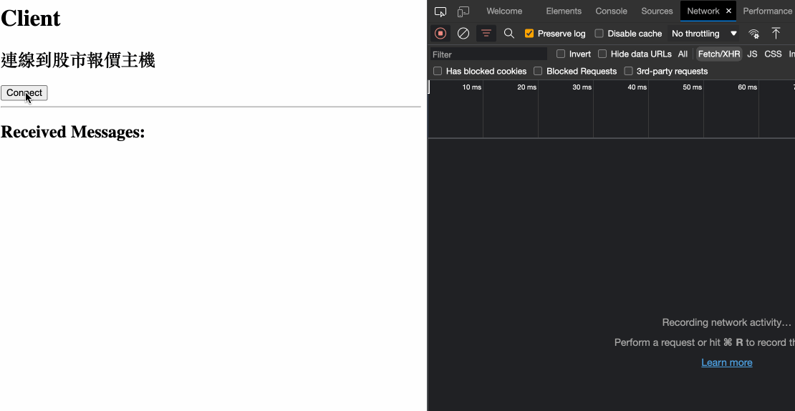
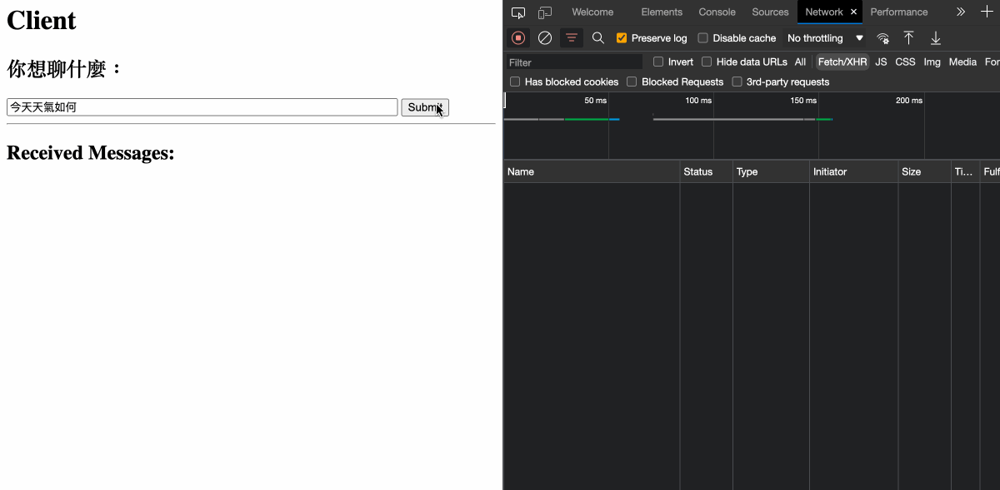

# Server-Sent Events (SSE) Demo

## Introduction

Simple demo using Python3 as server side. Including 2 use cases:
1. Stock Quotation
2. Chat with Bot

Tech stack:
* server: using Python3 with uvicorn + FastAPI.
* client: a simple client, using `EventSource` API supported by native JavaScript. None of 3rd-party lib is required.


## Quick Start

### Step 1: Start Server

Run at localhost:
```bash
$ cd app
$ python3 -m uvicorn server:app --host 127.0.0.1 --port 5000
```

Or you also can run by docker:
```bash
$ docker run -ti --name demoSSE -d -p 5000:5000 onejar99/server-sent-events-demo:latest
```

### Step 2: Test by Client

Demo 1: Stock Quotation
* client url: http://localhost:5000/static/clientStock.html



Demo 2: Chat with Bot
* client url: http://localhost:5000/static/clientChatBot.html




## Build & Release

```bash
$ majorTag=latest && buildTag=${majorTag}_$(date +"%Y%m%d") && echo $buildTag \
&& docker build -t onejar99/server-sent-events-demo:${buildTag} . \
&& docker image tag onejar99/server-sent-events-demo:${buildTag} onejar99/server-sent-events-demo:${majorTag} \
&& docker push onejar99/server-sent-events-demo:${buildTag} \
&& docker push onejar99/server-sent-events-demo:${majorTag}
```

## Refs about SSE

* [Server-sent events - Web APIs | MDN](https://developer.mozilla.org/en-US/docs/Web/API/Server-sent_events)


## References

- GitHub: https://github.com/onejar99/docker-personal-images
- Docker Repository: https://hub.docker.com/r/onejar99
